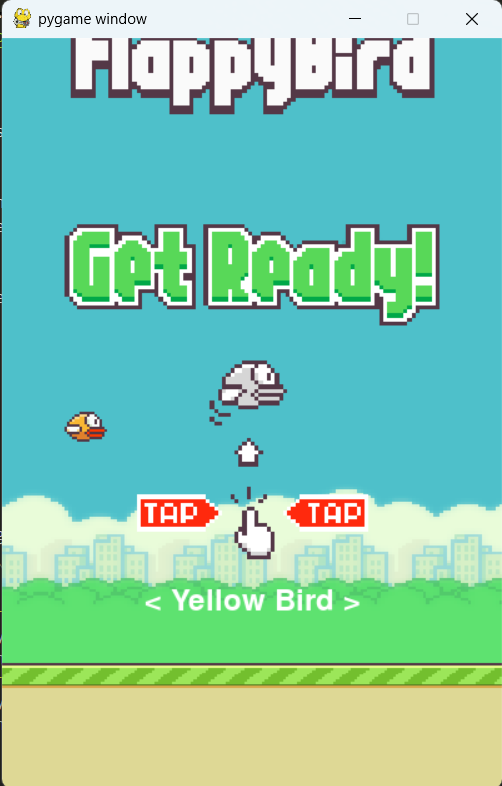
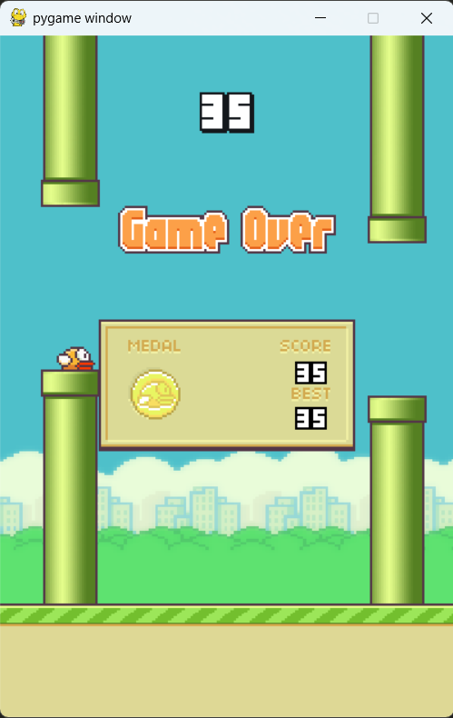

# 🐤 Flappy Bird - Pygame Edition

A Python-based remake of the iconic Flappy Bird game, built using [Pygame](https://www.pygame.org/). Featuring animated birds, colorful backgrounds, sound effects, and a medal-based scoring system!

---

## 🚀 Features

- 🎮 Classic Flappy Bird gameplay  
- 🐦 Select from 3 bird types: Yellow, Red, and Blue  
- 🏆 Score tracking with Bronze, Silver, Gold, and Platinum medals  
- 🎵 Authentic sound effects (wing, point, die, hit, swoosh)  
- 🎨 Retro pixel-art graphics  
- 🖥️ Responsive menu with bird hover animation  
- 🕹️ Easy controls (just press `SPACE` to flap)  

---

## 📁 File Structure

- `main.py`: Main game loop — run this to start the game.  
- `Score.py`: Handles menu screen, score tracking, and medal system.  
- `Bird.py`: Controls bird movement, animation, and collision.  
- `Pipe.py`: Controls pipe generation, movement, and collision logic.  
- `config.py`: Loads assets (images/sounds), sets constants like screen size, FPS, bird types, and image scaling.  

---

## 🛠 Requirements

- Python 3.7+  
- [Pygame](https://www.pygame.org/) ≥ 2.0.0  

Install dependencies via pip:

```bash
pip install pygame
```

---

## 📦 Installation

1. **Clone the repository:**

```bash
git clone https://github.com/unusual9guy/Flappy-Bird.git
```

2. **Ensure assets are in place:**

Your project structure should look like this:

```
flappy-bird-pygame/
│
├── assets/
│   ├── audio/
│   │   ├── die.ogg
│   │   ├── die.wav
│   │   ├── hit.ogg
│   │   ├── hit.wav
│   │   └── point.ogg
│   │   └── point.wav
│   │   └── swoosh.ogg
│   │   └── swoosh.wav
│   │   └── wing.ogg
│   │   └── wing.wav
│   └── sprites/
│       ├── 0_small.png
│       ├── 0.png
│       ├── 1_small.png
│       ├── 1.png
│       ├── 2_small.png
│       ├── 2.png
│       ├── 3_small.png
│       ├── 3.png
│       ├── 4_small.png
│       ├── 4.png
│       ├── 5_small.png
│       ├── 5.png
│       ├── 6_small.png
│       ├── 6.png
│       ├── 7_small.png
│       ├── 7.png
│       ├── 8_small.png
│       ├── 8.png
│       ├── 9_small.png
│       ├── 9.png
│       ├── background-day.png
│       ├── background-night.png
│       ├── base.png
│       ├── bluebird-downflap.png
│       ├── bluebird-midflap.png
│       ├── bluebird-upflap.png
│       ├── bronze-medal.png
│       ├── gameover.png
│       ├── gold-medal.png
│       ├── message.png
│       ├── panel.png
│       ├── pipe-green.png
│       ├── pipe-red.png
│       ├── platuinum-medal.png
│       ├── redbird-downflap.png
│       ├── redbird-midflap.png
│       ├── redbird-upflap.png
│       ├── silver-medal.png
│       ├── yellowbird-downflap.png
│       ├── yellowbird-midflap.png
│       ├── yellowbird-upflap.png
|
|───src/
│   ├── Bird.py
│   ├── config.py
│   ├── main.py
│   ├── Pipe.py
│   ├── Score.py
|
|───README.md
```

3. **Run the game:**

```bash
python main.py
```

---

## 🎮 How to Play

- Press `SPACE` to flap and keep the bird flying.  
- Avoid crashing into pipes or falling off the screen.  
- Each pipe passed = +1 score.  
- Get medals based on your score:
  - 🥉 Bronze: 10+  
  - 🥈 Silver: 20+  
  - 🥇 Gold: 30+  
  - 💎 Platinum: 40+  

---

## 📸 Screenshots
 <p float="left">
  
  
</p>


---

## 📄 License

This project is for educational and entertainment purposes only and is **not affiliated with the original Flappy Bird creators**.

---

## 🙌 Acknowledgements

- Original game inspiration: *Flappy Bird* by .GEARS Studios  
- Sound and sprite assets sourced from public domain or game clones  

---

Made with ❤️ using Python & Pygame.
